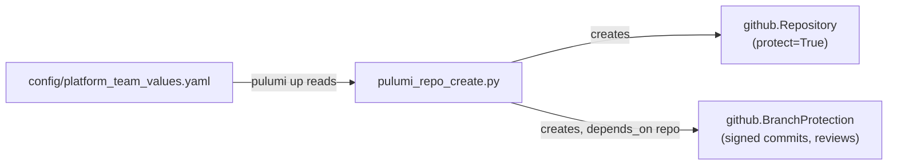
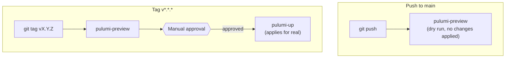

# Learning: platform-team-administration

A teaching companion for this repo, written for a technical PM learning platform
engineering hands-on — not a reference doc, a walkthrough of *why* this repo
exists and *why* it's built the way it is, with real commands you can run
against the actual live repos this project manages.

> **How to use this:** read top to bottom the first time. The boxes marked
> "Predict before reading on" are collapsed — try to answer before clicking
> them open. The `$` blocks are real commands with real output from this
> project, not illustrations.

---

## 1. Why this repo exists at all

Picture a small company where every team creates its own GitHub repos by
hand, clicking through the same eleven settings screens each time: Is branch
protection on? Are commits signed? How many reviewers are required? Six
months in, half the repos have it, half don't, and nobody can say why the
difference exists — it was whoever happened to click through the checklist
correctly that day.

This is exactly the failure mode platform engineering exists to prevent, and
the fix has a name: **the paved road**. Instead of every team improvising
their own path through the forest, the platform team builds one road with the
guardrails already installed — and everyone who takes it gets the same
guarantees, automatically, without having to remember eleven checkboxes.

`platform-team-administration` *is* that paved road, expressed as code. It
does not host application logic. Its entire job is: given a list of repos and
some rules, make sure those repos exist, with those rules enforced, every
time, the same way, forever — via `pulumi up`, not via a human clicking
through GitHub's settings UI.

That's also why this is the *first* repo built in this whole project, before
any actual platform runtime existed. You cannot pave a road before you decide
where the roads go.

---

## 2. The shape of it: config-driven repo creation

Every repo this project manages is declared in one file:
[`config/platform_team_values.yaml`](config/platform_team_values.yaml). Not
created by running a script with arguments, not clicked into existence in a
browser — *declared*, the same way you'd declare a variable. The distinction
matters: a declared thing can be diffed, reviewed in a pull request, and
reasoned about by reading a file instead of reconstructing tribal knowledge
about "how we usually set up a repo."

```yaml
github_repositories:
  - name: platform-core
    description: >
      Core platform runtime: Kubernetes cluster provisioning, network
      configuration, and service mesh setup.
    visibility: public
```

[`pulumi_repo_create.py`](pulumi_repo_create.py) reads this file and, for
every entry, creates two connected things:



Two details in that diagram are load-bearing, not decoration:

- **`protect=True`** on the repository resource means `pulumi destroy` will
  *refuse* to delete it. Pulumi's whole value proposition is "the code is the
  source of truth, so destroying the code's declaration destroys the real
  thing" — and here we're deliberately opting *out* of that for the one
  resource type where "oops" is unrecoverable. A misconfigured Kubernetes
  namespace can be recreated in seconds; a deleted GitHub repo's issue
  history cannot.
- **`depends_on=[repo]`** on the branch protection resource is why the order
  in the diagram is guaranteed, not coincidental. Pulumi doesn't run steps
  top-to-bottom through your code; it builds a dependency graph and only
  builds a resource once everything it depends on already exists. Without
  this line, Pulumi could try to protect a branch on a repo that doesn't
  exist yet.

**Try it yourself** — every repo this file declares is real and public right
now:

```console
$ gh repo list phrankson --limit 10
phrankson/platform-services      public
phrankson/platform-core          public
phrankson/platform-team-admin    public
phrankson/platform-gitops        public
phrankson/platform-extensions    public
phrankson/platform-demo-apps     public
```

Six of those (all but the two unrelated personal repos further down the real
list) exist purely because a line was added to
`platform_team_values.yaml` and `pulumi up` was run. Nobody clicked "New
repository" in GitHub's UI for any of them.

---

## 3. Branch protection, and the two ways this bit us for real

The `github.BranchProtection` resource above sets three things on `main` for
every repo: `enforce_admins=True`, `require_signed_commits=True`, and a
configurable `required_approving_review_count`. Each of the first two exists
for a specific reason worth understanding, not just copying.

**Signed commits** mean every commit on `main` carries cryptographic proof of
who actually wrote it — a GPG or SSH key, not just a `user.name` string
anyone could type into `git config`. This is table stakes for SOC 2 / ISO
27001-style compliance: an auditor asking "prove Alice wrote this commit" gets
a cryptographic answer instead of "we trust our git config."

**`enforce_admins`** means these rules apply even to the organization owner —
including the very account running this Pulumi program. This is the
uncomfortable but correct default: a rule that the person who wrote it can
personally bypass isn't really a rule, it's a suggestion with extra steps.

That correctness collided with reality almost immediately, on a
solo-maintained repo.

<details>
<summary><strong>Predict before reading on:</strong> <code>enforce_admins</code> is on, <code>required_approving_review_count</code> was <code>1</code>, and there is exactly one GitHub account on this whole project — the same account that opens every PR. What happens when that account tries to merge its own change?</summary>

GitHub will not let you approve your own pull request — self-approval is
disallowed by the platform itself, not a setting. So the PR needs one
approval to merge, the only human on the project cannot provide it, and
`enforce_admins` means the org owner can't override the block either. The PR
is permanently stuck: not because anything is broken, but because two
correct-in-isolation rules (require a review, don't let admins skip rules)
combine into a deadlock the moment there's only one person.

The fix wasn't to turn either rule off — it was to make the number itself
config-driven instead of hardcoded:

```python
required_approving_review_count: int = data.get("branch_protection", {}).get(
    "required_approving_review_count", 1
)
```

`platform_team_values.yaml` now sets this to `0` with a comment explaining
exactly why, and exactly when to raise it back:

```yaml
# required_approving_review_count: 0 while solo-maintaining with a single
# GitHub account (self-approval isn't allowed and enforce_admins blocks
# bypassing it). Raise back to 1+ once a second reviewer/collaborator exists.
branch_protection:
  required_approving_review_count: 0
```

This is worth sitting with: the "fix" isn't a workaround bolted on top, it's
making the *rule itself* honestly reflect a real constraint (team size) that
the original hardcoded `1` was silently assuming away.
</details>

A second, smaller gotcha: GitHub's **Free tier cannot apply branch protection
to a *private* repository** — the feature is Free-tier-only for public repos.
Every repo in `platform_team_values.yaml` is `visibility: public` for exactly
this reason. Not a security posture choice — a plan-tier constraint that
shaped a visibility decision.

**Try it yourself:**

```console
$ gh api repos/phrankson/platform-team-admin/branches/main/protection \
    --jq '{enforce_admins: .enforce_admins.enabled, signed_commits: .required_signatures.enabled, reviews_required: .required_pull_request_reviews.required_approving_review_count}'
{
  "enforce_admins": true,
  "signed_commits": true,
  "reviews_required": 0
}
```

That's not a mockup — that's the real, live branch protection state on the
real repo, matching the config file exactly.

---

## 4. Secrets: why Bitwarden, and a bug that actually overwrote something

Pulumi needs a GitHub token to create repos. That token can't live in the
repo, in an env var checked into git, or anywhere version control can see it
— so it lives in Bitwarden, and
[`secrets-setup/load_secrets.sh`](secrets-setup/load_secrets.sh) is the
one-way door that gets local `*.json` secret definitions *into* the vault.

The script's core logic is a create-or-update loop: for every JSON file, if
an item with that exact name already exists in the vault, update it;
otherwise, create it. That "exact name" phrase is doing more work than it
looks like.

<details>
<summary><strong>Predict before reading on:</strong> Bitwarden's CLI has a lookup command, <code>bw get item &lt;name&gt;</code>, that does <em>fuzzy</em> matching — it finds the closest-named item, not necessarily an exact one. If you use that command to check "does an item named 'Pulumi Secrets' already exist" in a vault that already has an item called "GitHub Secrets," what can go wrong?</summary>

This happened for real, mid-session, on the actual vault this project uses.
Creating a new item called "Pulumi Secrets" via a naive `bw get item`-based
lookup fuzzy-matched onto the *existing* "GitHub Secrets" item — close enough
in Bitwarden's matching logic — and the update path overwrote it with the
new item's contents. The GitHub Secrets item was gone, replaced by Pulumi's.

The fix, already reflected in the script you're reading, replaces the fuzzy
lookup with an exact-match filter:

```bash
# bw get item does a fuzzy/word match, not an exact-name lookup, which can
# collide with unrelated items in a large vault. List + exact-match instead.
existing_item=$(bw list items --search "$item_name" --session "$BW_SESSION" 2>/dev/null \
    | jq --arg n "$item_name" '[.[] | select(.name == $n)] | first // empty')
```

`bw list items --search` still does a broad search — but piping the results
through `jq`'s `select(.name == $n)` throws away every result that isn't a
byte-for-byte name match before anything gets treated as "the existing item."
The lost item wasn't unrecoverable here (it was recreated from a local JSON
file), but the lesson generalizes: **any time a tool's "find by name" is
fuzzy, "check if X exists" and "find what X actually is" are two different
operations, and conflating them is how automation quietly destroys data.**
</details>

**Try it yourself** — this only requires `jq`, no Bitwarden session needed,
to see the exact-match filter in isolation:

```console
$ echo '[{"name":"GitHub Secrets","id":"a1"},{"name":"Pulumi Secrets","id":"b2"}]' \
    | jq --arg n "Pulumi Secrets" '[.[] | select(.name == $n)] | first'
{
  "name": "Pulumi Secrets",
  "id": "b2"
}
```

Change `$n` to `"Pulumi"` (a fuzzy fragment instead of the exact name) and
the result is `null` — proof the exact-match guard actually rejects a
near-miss instead of silently accepting it.

---

## 5. Commit hooks: the same paved-road idea, one layer down

[`.git-hooks/commit-msg`](.git-hooks/commit-msg) enforces the
[Conventional Commits](https://www.conventionalcommits.org/) format
(`type(scope): description`) on every commit, locally, before it's even
pushed. [`scripts/install-githooks.sh`](scripts/install-githooks.sh) copies
that hook into `.git/hooks/` — a directory git itself never syncs between
clones, which is exactly why the hook has to be a file *in* the repo plus an
install step, rather than something git picks up automatically.

This is the same principle as branch protection, just enforced earlier and
locally instead of server-side on GitHub: a rule that's easy to bypass by
forgetting isn't a rule. The install script exists so every clone of this
repo gets the identical hook, the same way every repo in
`platform_team_values.yaml` gets identical branch protection — one small
paved road, same shape as the big one.

**Try it yourself:**

```console
$ ./scripts/install-githooks.sh
Successfully installed commit-msg hook
Git hooks installation complete
  Source:  /path/to/platform-team-administration/.git-hooks/commit-msg
  Target:  /path/to/platform-team-administration/.git/hooks/commit-msg
Commit messages will now be validated for conventional commits format
```

After that, try committing with a message that doesn't match the pattern
(e.g. `git commit --allow-empty -m "fixed stuff"`) and watch it get rejected
before it ever becomes a commit.

---

## 6. CI/CD: push previews, tags deploy

The pipeline in
[`.circleci/config.yml`](.circleci/config.yml) draws a hard line between two
kinds of change, using two different Git triggers:



A plain push to `main` only ever *previews* — it shows what Pulumi would
change, as fast CI feedback, but touches nothing real. Applying a change for
real requires a semver tag (`v1.2.3`) *and* a human clicking approve in
CircleCI. This is deliberate friction placed exactly once, at the one step
that has real, hard-to-reverse consequences (creating org-visible
repositories, changing every team's branch protection) — every earlier step
stays fast and automatic precisely because this one is not.

**Try it yourself** — you don't need CircleCI access to see the shape of
this; the filters are plain YAML:

```console
$ grep -A2 "tag_main:" .circleci/config.yml
  tag_main: &tag_main
    filters:
      tags:
        only: /^v.*/
```

---

## Where this leads next

Every repo `platform-team-administration` creates is inert on its own — a
named, protected, empty container. The next repo in this project,
`platform-core`, is where something actually gets *built* inside one of
those containers: real Kubernetes clusters, running on your own machine. See
[`platform-core/LEARNING.md`](../platform-core/LEARNING.md) *(once it
exists)* for that half of the story.
