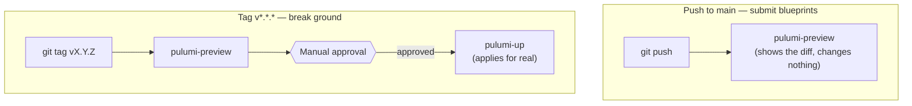

# Hooks, Secrets, and CI/CD

Part of the [platform-team-administration learning companion](README.md).
Read [Repos and Governance](repos-and-governance.md) first — this picks up
right after branch protection.

---

## Two inspectors, not one

A construction crew keeps its own safety checklist on-site — hard hats,
scaffolding bolted correctly, wiring double-checked — before they ever call
the city to schedule an inspection. That checklist is fast and catches
mistakes early, while they're cheap to fix. But it's also just a clipboard
on a nail: a rushed crew *can* skip it, and nothing physically stops them.
The city's actual inspector is slower and shows up later, but cannot be
skipped, argued with, or rushed — that's the real backstop.

This repo has both layers, and understanding *why both exist* (rather than
just picking one) is the point of this section:

- **[`.git-hooks/commit-msg`](../.git-hooks/commit-msg)** is the crew's own
  clipboard — it runs on *your own machine*, the instant you commit,
  rejecting a message that doesn't follow
  [Conventional Commits](https://www.conventionalcommits.org/)
  (`type(scope): description`) before the commit even finishes being made.
  Fast feedback, zero network round-trip. But it's enforced by a file
  sitting in `.git/hooks/` on your machine — trivially bypassed with
  `git commit --no-verify`, or simply never installed by someone who cloned
  the repo and skipped the setup step.
- **`github.BranchProtection`**, from the previous section, is the city
  inspector — enforced server-side, by GitHub itself, on every single push
  regardless of whose machine it came from or what local shortcuts they
  took. This is the layer that actually can't be skipped.

Git itself never syncs `.git/hooks/` between clones — it's local machine
state by design, which is exactly why
[`scripts/install-githooks.sh`](../scripts/install-githooks.sh) exists as a
separate, explicit step: copy the hook from the repo (`.git-hooks/`, which
*is* tracked) into the untracked location git actually reads it from
(`.git/hooks/`).

**Try it yourself:**

```console
$ ./scripts/install-githooks.sh
Successfully installed commit-msg hook
Git hooks installation complete
Commit messages will now be validated for conventional commits format

$ git commit --allow-empty -m "fixed stuff"
Error: Commit message does not follow conventional commits format
Valid format: type(scope)?: description
```

The message gets rejected locally, instantly, before it ever leaves your
machine — but nothing stops you from bypassing it with `--no-verify` if
you're in a hurry, which is precisely why this layer alone would never be
enough on its own.

## Utility hookups: why secrets can't just live in the repo

A construction crew doesn't run their own illegal tap into the city water
main — utilities get connected through a permitted, audited process, with
a specific account responsible for what flows through that connection.
Secrets — API tokens, passwords — are the same category of thing:
something the system needs to function, that must never be something
anyone can just wire in themselves.

Here's the concept that makes this non-negotiable, not just tidy: **git
never truly deletes anything.** If a secret is committed to a repository —
even once, even if the very next commit removes it — it remains
retrievable forever in that repo's history, by anyone who ever clones it,
unless the entire history is surgically rewritten (and every existing
clone somehow tracked down and fixed too). This is exactly why
Pulumi's GitHub token doesn't live in this repo, or in an env var file
checked into git, or anywhere version control can ever see it. It lives in
Bitwarden, and
[`secrets-setup/load_secrets.sh`](../secrets-setup/load_secrets.sh) is the
one-way door that gets local `*.json` secret *definitions* — never the
final, real values — into the vault.

The script's logic is a create-or-update loop: for each JSON file, if an
item with that *exact* name already exists in the vault, update it;
otherwise create it. The word "exact" is doing real work here.

<details>
<summary><strong>Predict before reading on:</strong> Bitwarden's CLI has a lookup command, <code>bw get item &lt;name&gt;</code>, that does <em>fuzzy</em> matching — it finds the closest-named item, not necessarily an exact one. If you use that command to check "does an item named 'Pulumi Secrets' already exist" in a vault that already has an item called "GitHub Secrets," what can go wrong?</summary>

This happened for real, on the actual vault this project uses. Creating a
new item called "Pulumi Secrets" via a naive `bw get item`-based lookup
fuzzy-matched onto the *existing* "GitHub Secrets" item — close enough in
Bitwarden's matching logic — and the update path overwrote it with the new
item's contents. The GitHub Secrets item was gone, replaced by Pulumi's.

The fix, already reflected in the script, replaces the fuzzy lookup with an
exact-match filter:

```bash
# bw get item does a fuzzy/word match, not an exact-name lookup, which can
# collide with unrelated items in a large vault. List + exact-match instead.
existing_item=$(bw list items --search "$item_name" --session "$BW_SESSION" 2>/dev/null \
    | jq --arg n "$item_name" '[.[] | select(.name == $n)] | first // empty')
```

`bw list items --search` still does a broad search — but piping the
results through `jq`'s `select(.name == $n)` throws away every result
that isn't a byte-for-byte name match before anything gets treated as "the
item that exists." The lost item wasn't unrecoverable here (recreated from
a local file), but the lesson generalizes past Bitwarden entirely: **any
time a tool's "find by name" is fuzzy, "check whether X exists" and "find
what X actually is" are two different operations — conflating them is how
automation quietly destroys data it was never asked to touch.**

Try the exact-match logic in isolation, no vault needed:

```console
$ echo '[{"name":"GitHub Secrets","id":"a1"},{"name":"Pulumi Secrets","id":"b2"}]' \
    | jq --arg n "Pulumi Secrets" '[.[] | select(.name == $n)] | first'
{
  "name": "Pulumi Secrets",
  "id": "b2"
}
```

Change `$n` to the fuzzy fragment `"Pulumi"` and the result is `null` —
proof the exact-match guard actually rejects a near-miss instead of
silently accepting it.
</details>

## Inspection before occupancy: the CI/CD pipeline

A building doesn't go from blueprint to occupied in one step. Blueprints
get submitted and reviewed *first* — no groundbreaking yet, just "here's
what we intend to build, tell us if it's wrong." Only once that's approved
does anyone actually break ground. [`.circleci/config.yml`](../.circleci/config.yml)
encodes exactly this two-phase idea using two different Git triggers:



The general concept underneath this, worth knowing independent of
CircleCI or Pulumi entirely: **continuous deployment needs friction placed
deliberately at exactly one point, not scattered everywhere and not
removed entirely.** Zero friction (every push deploys instantly) means a
bad change is live before any human sees it coming. Friction at *every*
step means nothing ships quickly enough to be useful, and people start
routing around the process out of sheer impatience. The right answer is
friction concentrated at the one step with real, hard-to-reverse
consequences — here, that's a semver tag *plus* a human clicking approve
in CircleCI — while every earlier step (preview, linting) stays instant
and automatic, because those steps can't hurt anything on their own.

**Try it yourself** — the trigger logic is plain YAML, no CircleCI access
needed to see the shape of it:

```console
$ grep -A3 "tag_main:" .circleci/config.yml
  tag_main: &tag_main
    filters:
      tags:
        only: /^v.*/
      branches:
        ignore: /.*/
```

---

## Where this leads next

Every repo this department issues a permit for is still an empty parcel —
nothing has been built on it yet. The next repo in this project,
`platform-core`, is where something actually gets constructed inside one of
those parcels: real Kubernetes clusters, running on your own machine. See
[`platform-core`'s learning companion](../../platform-core/learning/README.md)
for that half of the story.
